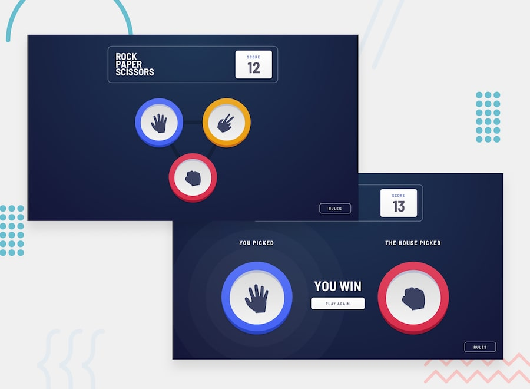

# Rock Paper Scissors

A simple browser-based Rock, Paper, Scissors game built with vanilla JavaScript (ES6 classes and modules). No frameworks, no build tools, no bundler — just plain HTML, CSS, and JS.

## Features

- Classic Rock / Paper / Scissors gameplay against the "house" (computer)
- Score tracking that persists across page reloads using `localStorage`
- Simple "processing" animation while the house makes its choice
- Win / lose / tie result screen with a "Play Again" option



## Live Demo

Live link: https://muhammadabdullah81.github.io/Javascript-rock-paper-scissors/

## Project Structure

```
.
├── index.html
├── styles/
│   └── (your CSS files)
├── images/
│   ├── icon-rock.svg
│   ├── icon-paper.svg
│   └── icon-scissors.svg
├── classes/
│   ├── player.js
│   └── house.js
└── script.js
```

> Note: The exact folder names may differ depending on how your project is organized — adjust the tree above to match your actual layout.

## How It Works

- **`Player` class** (`classes/player.js`) — tracks the player's current choice, win/loss state, and score. The score is read from and written to `localStorage` under the key `playerScore`, so it persists between sessions.
- **`House` class** (`classes/house.js`) — represents the computer opponent. It randomly picks `rock`, `paper`, or `scissors` after a short simulated "thinking" delay (via `setTimeout` wrapped in a `Promise`).
- **`script.js`** — wires everything together: listens for the player's clicks, triggers the house's choice, determines the winner, updates the UI, and handles resetting the game.

## Getting Started

This project uses native ES modules (`import` / `export`), so it needs to be served over `http://` rather than opened directly as a `file://` URL (browsers block ES module imports from the local filesystem due to CORS restrictions).

You can use any lightweight static file server you already have available on your machine to preview `index.html` — for example, a static server built into your code editor, or any local server you're comfortable with. This project has no dependencies and requires no installation or build step.

## How to Play

1. Click one of Rock, Paper, or Scissors.
2. The house will "think" for a few seconds before revealing its choice.
3. The winner is determined and displayed on screen, along with your updated score.
4. Click **Play Again** to reset the round and play again.

## Game Rules

- Rock beats Scissors
- Scissors beats Paper
- Paper beats Rock
- Matching choices result in a Tie

## Notes

- The player's score persists across browser sessions via `localStorage`. Clearing your browser storage (or using a different browser/incognito window) will reset it.
- All game state (choices, win/loss flags) resets when you click **Play Again**, but the cumulative score is only decremented/incremented, never wiped, unless `localStorage` is cleared manually.
